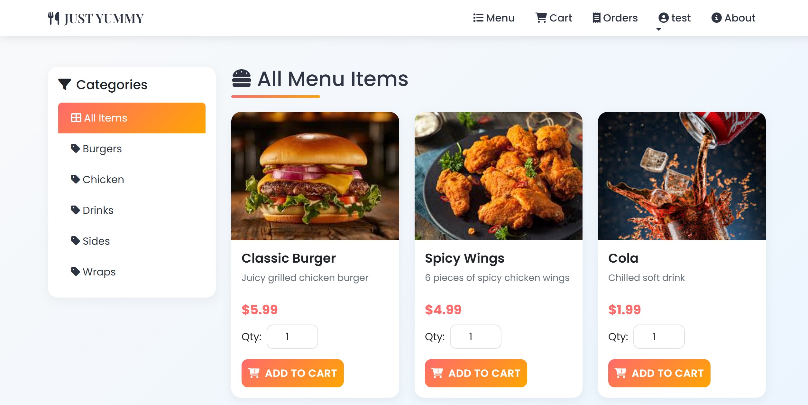
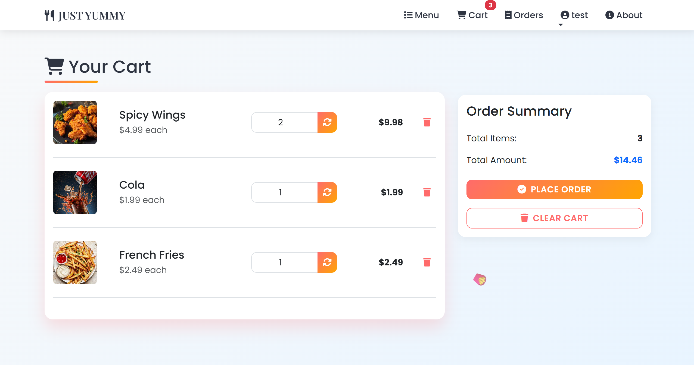
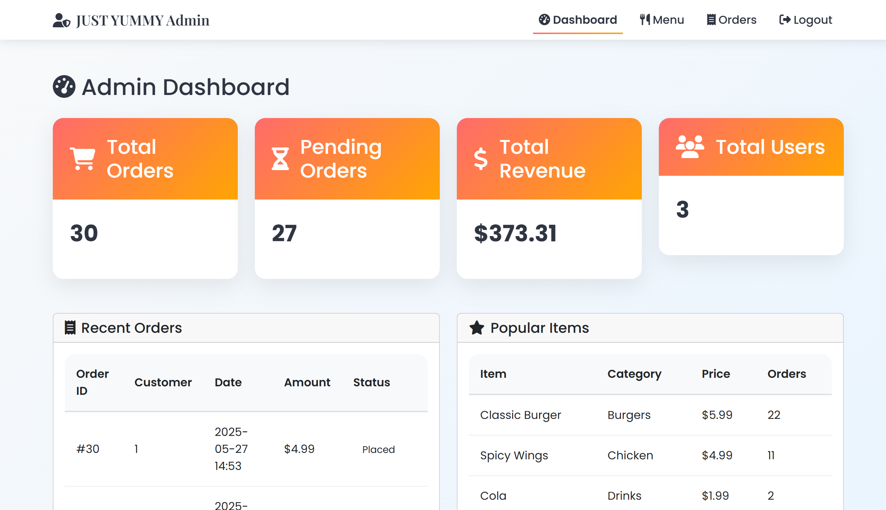
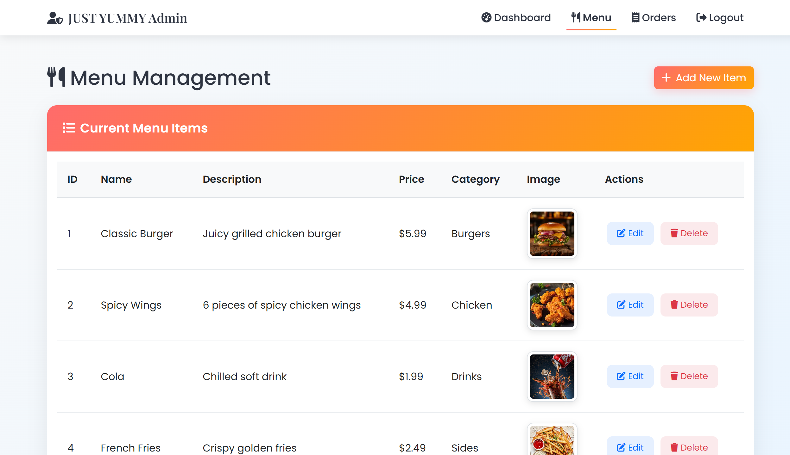

# 🍽️ Food Ordering System

A full-featured, dynamic Food Ordering System developed using Java, JSP, Servlets, SQL Server, and modern front-end technologies. This project is designed to make the process of browsing menus, placing orders, and managing food services seamless for customers and administrators.

---

## 🚀 Tech Stack

### 🔧 Backend:
- Java (OOP Concepts)
- JSP (JavaServer Pages)
- Javax Servlet
- Apache Tomcat (Web Server)
- SQL Server (Database)

### 🎨 Frontend:
- HTML5
- CSS3
- JavaScript
- Bootstrap 5
- Font Awesome

---

## 📌 Key Features

### 👥 User Panel:
- 🔐 User Registration & Login
- 🍔 Browse and search food items
- 🛒 Add to cart & checkout
- 🧾 View order history
- ✍️ Leave reviews & ratings

### 🧑‍💼 Admin Panel:
- 📊 System Overview
- 📋 Manage food items (Add/Edit/Delete)
- 📦 View and manage orders
- 📊 View customer feedback

---

## 📸 Screenshots

### 🏠 Homepage

<table>
  <tr>
    <td></td>
    <td></td>
  </tr>
  <tr>
    <td align="center">📦 Login Page</td>
    <td align="center">📦 Register Page</td>
  </tr>
  <tr>
    <td></td>
    <td></td>
  </tr>
  <tr>
    <td align="center">🍽️ Menu</td>
    <td align="center">✍️ Cart</td>
  </tr>
    <tr>
    <td></td>
    <td></td>
  </tr>
  <tr>
    <td align="center">📦 Admin Dashboard</td>
    <td align="center">📦 Menu Management</td>
  </tr>
</table>

---

## 🔗 Links

- 👨‍💻 Author: [Vinod Madhuranga](https://github.com/Vinod-Madhuranga)
- 📦 Repo: [github.com/Vinod-Madhuranga/Toy-Store](https://github.com/Vinod-Madhuranga/Toy-Store)
